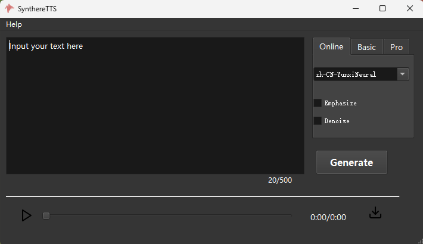

# SynthereTTS: 具有真实感的中文语音合成

 
[English](README.md) | 中文
 

SynthereTTS 在简洁的用户界面中引入独特的技巧，提供更具真实感的语音合成与声音克隆应用。 

 

 

##  Updates

- 

  

## 功能特点

Synther TTS具有以下特征：

1. **可选的基础和高级模型**: 基础模型使用预训练的vits模型，高级版建立在GPT-SoVITS模型之上。

2. **强调可设置**: 使用[]可任意设置需要强调的词或短语。

3. **噪声抑制**: 噪声抑制功能可自适应抑制生成的噪声，提高生成的音频质量。

4. **克隆与跨语言语音合成**: 除通过说话人声音训练模型外，还可直接使用不同于预训练模型的说话人参考音频合成带有参考音频音色的声音。
5. **易于使用**：使用pyqt重写的前端界面，高效并摒除了繁杂的参数设置，可打包成独立的可执行程序使用。

## 硬件要求

 可以在CPU或GPU上运行。CPU运行高阶版时速度较慢。若使用GPU运行，你需要至少8GB的显存；CPU运行建议16G及以上内存。

### 支持的语言

| 语言      | 状态  |
| ------- |:---:|
| 英语 (en) | ✅   |
| 中文 (zh) | ✅   |

##  FAQ
#### 如何打包成独立的可执行程序?

* 可使用pyinstaller等工具将代码打包成独立的可执行程序，方便使用。目前已在windows平台验证。

#### 在哪里可以下载checkpoint及如何放置?

* 基础版中使用的vits模型可从[sherpa-onnx](https://github.com/k2-fsa/sherpa-onnx)提供的链接中下载。高级版的预训练模型可从[GPT_SoVITS](https://github.com/RVC-Boss/GPT-SoVITS) 中提供的链接下载，也可根据提示训练自己的模型。训练好的模型（sovits.pth、gpt.ckpt)和bert模型均放到_internal/weights目录里。

#### 能否生成长文本?

* 文本长度增加时高阶模型的生成时间会大幅增加。虽然可以通过修改限制实现更长文本合成，仍然建议将文本拆分后分段进行。

#### 更多...

## 待办事项
- [ ] 添加语调控制
- [ ] 基础版模型添加强调和噪声抑制
- [ ] 增加强调级别，提供热点词映射不同强调等级
- [ ] 更多...
- [ ] 

## 感谢

- [Controllable Emphasis with zero data for text-to-speechr](https://arxiv.org/abs/2307.07062) 强调控制的洞见
- [sherpa-onnx](https://github.com/k2-fsa/sherpa-onnx) 高效易用的VITS模型
- [GPT_SoVITS](https://github.com/RVC-Boss/GPT-SoVITS) 提供了卓越的中文语音合成模型

